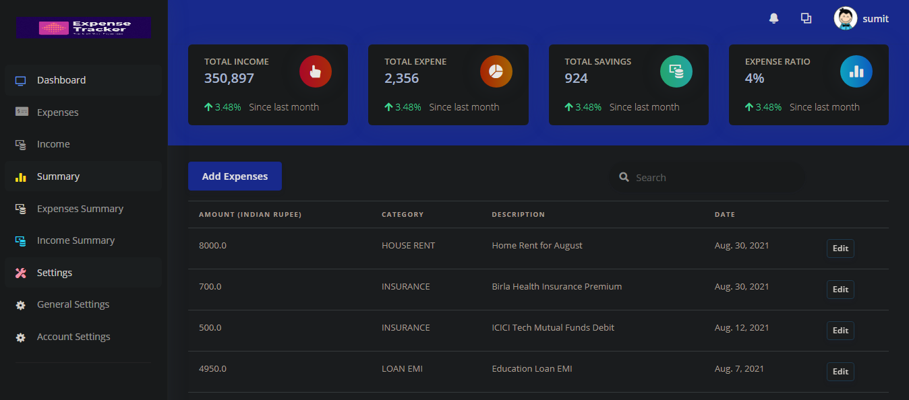
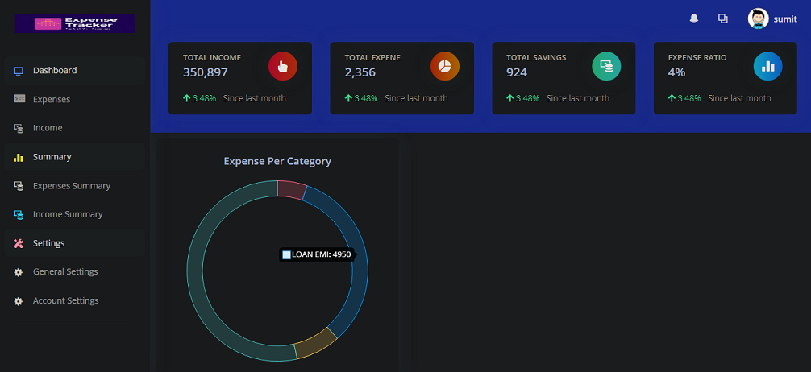

# ExpenseTracker
 Expense tracker is complete app to track your all the expenses bared by your pocket or bared by you & manage your personal finance.
  
 
 Expense Tracker Provide a simple web based potral to manage all your expense. 
 ## Key Highlight are:
 <ol>
 <li>Functionality to add & Edit Expenses</li>
 <li>Functionality to add & Edit Income</li>
 <li>Visual Representation of Expense & Income Summary (Using Chart & Graphs) </li>
 <li>Functionality to download the Data in (CSV, XLS, PDF) format</li>
 </ol>
 
 ## Tech Stack:
<ol>
 <li>Pyhton </li>
 <li>Django </li>
 <li>PostgreSQL </li>
 <li>Bootstrap 5 </li>
 <li>Chart.js</li>
 </ol>
 </ul>
  
 
 
  
 
  
 
